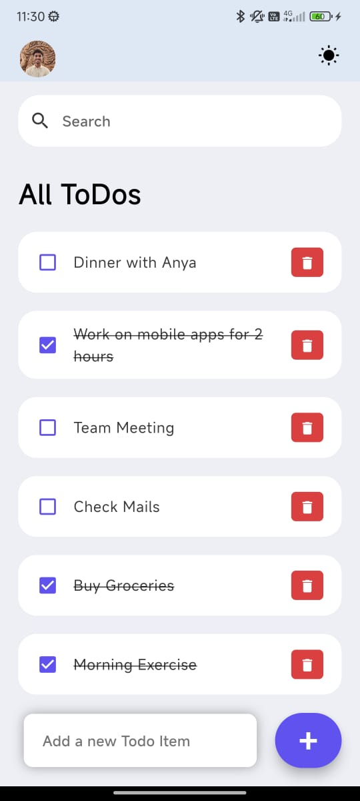
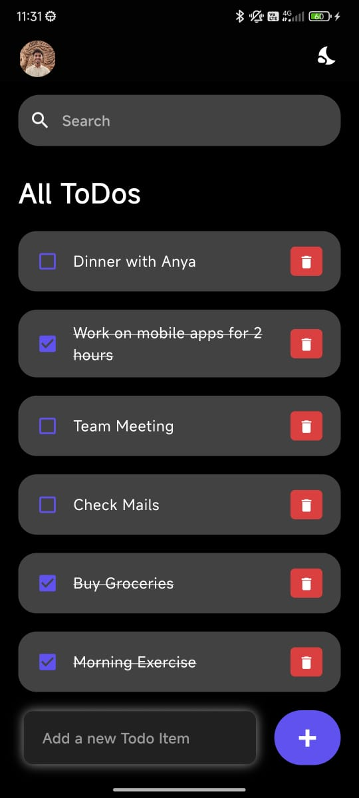

# ToDo App

A simple and elegant ToDo application built with Flutter, featuring support for light and dark themes, search functionality, and a dynamic list of tasks.

## Features

- **Add Tasks:** Easily add new tasks to your list.
- **Delete Tasks:** Remove tasks once they're completed or no longer needed.
- **Mark as Done:** Toggle the status of tasks between complete and incomplete.
- **Search Tasks:** Quickly find tasks using the search functionality.
- **Dark Mode:** Switch between light and dark themes for better accessibility.

## Screenshots

 


## Installation

1. **Clone the repository:**
    ```sh
    git clone https://github.com/yourusername/todo_app.git
    cd todo_app
    ```

2. **Install dependencies:**
    ```sh
    flutter pub get
    ```

3. **Run the application:**
    ```sh
    flutter run
    ```
